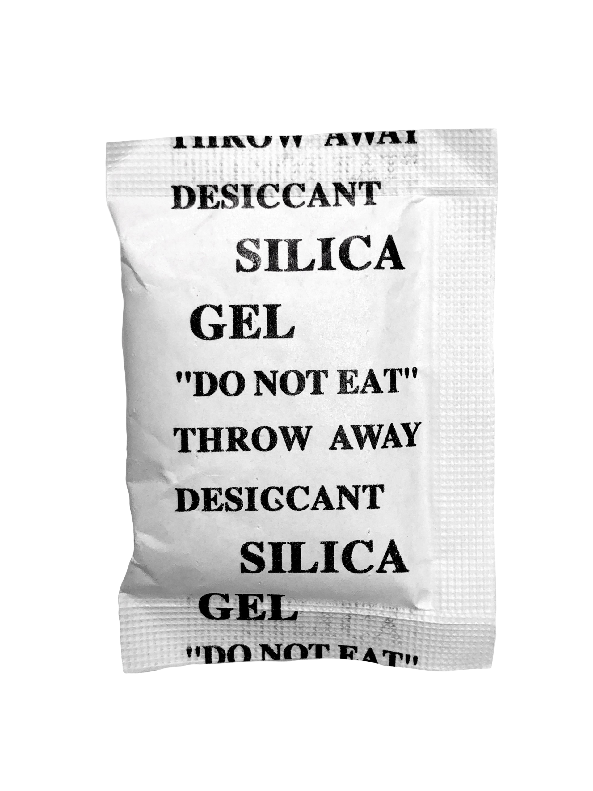

<!-- markdownlint-disable first-line-h1 -->

[](https://npmjs.com/package/aboutproject) [](https://github.com/okineadev/silica-gel/actions/workflows/test.yml) [](https://bun.sh) [](https://biomejs.dev/)

<!-- markdownlint-capture -->
<!-- markdownlint-disable no-inline-html heading-start-left -->
<div align="center">

  # SILICA GEL

  

  > **Silica Gel for JavaScript**
</div>
<!-- markdownlint-restore -->

## 📦 Installation

```bash
npm install @okinea/silica-gel
```

## 🚀 Usage

```typescript
import { SILICA_GEL } from '@okinea/silica-gel'

SILICA_GEL()
// DESICCANT SILICA GEL THROW AWAY "DO NOT EAT"
```

## 🤔 Why?

idk.

## 📑 Wiki

- <https://en.wikipedia.org/wiki/Silica_gel>

## ❤️ Support

If you like this project, consider supporting it by starring ⭐ it on GitHub, sharing it with your friends, or [buying me a coffee ☕](https://github.com/okineadev/silica-gel?sponsor=1)

## 📝 License

MIT © [Okinea Dev](https://github.com/okineadev)
